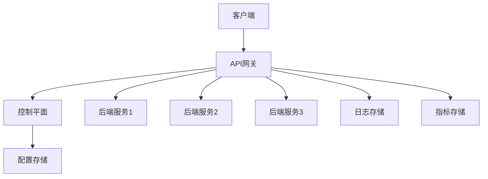

# API网关产品文档

## 1. 产品概述

MinGo API网关是一款基于ASP.NET Core和YARP实现的企业级API网关产品，旨在为微服务架构提供统一的流量入口、请求路由、负载均衡和安全防护能力。

### 1.1 产品定位

- **统一入口**：为所有微服务提供单一访问入口，简化客户端调用
- **流量管理**：智能路由、负载均衡、流量控制
- **安全防护**：认证授权、API密钥管理、请求过滤
- **可观测性**：详细的访问日志、监控指标
- **控制平面**：基于Blazor的可视化管理界面

### 1.2 目标用户

- 微服务架构的开发团队
- 需要统一API管理的企业
- 希望提升系统安全性和可观测性的技术团队

## 2. 核心功能

### 2.1 基础功能

#### 2.1.1 服务路由
- **路径路由**：基于URL路径的精确匹配和前缀匹配
- **域名路由**：基于请求域名的路由规则
- **Header路由**：基于HTTP Header的路由规则
- **查询参数路由**：基于URL查询参数的路由规则

#### 2.1.2 负载均衡
- **轮询**：按顺序分发请求
- **最少连接**：选择当前连接数最少的后端实例
- **随机**：随机选择后端实例
- **权重**：基于配置权重分发请求

#### 2.1.3 健康检查
- **HTTP健康检查**：定期发送HTTP请求检查后端服务状态
- **TCP健康检查**：通过TCP连接检查后端服务状态
- **自定义健康检查**：支持自定义健康检查逻辑

#### 2.1.4 流量控制
- **速率限制**：基于IP、API密钥或用户的请求速率限制
- **并发控制**：限制同时处理的请求数量
- **带宽限制**：限制请求和响应的带宽

### 2.2 安全功能

#### 2.2.1 认证授权
- **JWT认证**：支持JSON Web Token认证
- **API密钥认证**：基于API密钥的认证机制
- **OAuth2集成**：支持OAuth2协议的认证流程
- **自定义认证**：支持自定义认证逻辑

#### 2.2.2 请求过滤
- **IP白名单/黑名单**：基于IP地址的访问控制
- **请求大小限制**：限制请求体大小
- **恶意请求检测**：检测和阻止恶意请求

#### 2.2.3 数据加密
- **HTTPS支持**：强制使用HTTPS协议
- **请求/响应加密**：支持自定义加密逻辑

### 2.3 可观测性功能

#### 2.3.1 日志管理
- **访问日志**：详细记录所有API访问请求
- **错误日志**：记录系统错误和异常
- **自定义日志**：支持自定义日志格式和输出

#### 2.3.2 监控指标
- **请求量**：实时统计API请求数量
- **响应时间**：监控API响应时间
- **错误率**：统计API错误率
- **系统指标**：监控网关系统资源使用情况

#### 2.3.3 分布式追踪
- **OpenTelemetry集成**：支持OpenTelemetry协议的分布式追踪
- **自定义追踪**：支持自定义追踪逻辑

### 2.4 控制平面

#### 2.4.1 可视化管理界面
- **服务管理**：管理后端服务和路由规则
- **配置管理**：管理网关配置和策略
- **监控面板**：实时查看网关运行状态和监控指标
- **日志查询**：查询和分析网关日志

#### 2.4.2 配置管理
- **动态配置**：支持运行时动态更新配置
- **配置版本控制**：支持配置的版本管理和回滚
- **配置导入/导出**：支持配置的导入和导出

#### 2.4.3 多环境支持
- **环境隔离**：支持开发、测试、生产等多环境配置
- **环境切换**：支持快速切换不同环境的配置

## 3. 技术架构

### 3.1 技术栈

- **后端**：ASP.NET Core 8.0+
- **网关核心**：YARP (Yet Another Reverse Proxy)
- **前端**：Blazor Server
- **UI框架**：Tailwind CSS
- **数据存储**：
  - 配置存储：JSON文件/数据库
  - 日志存储：文件/ELK/数据库
- **监控**：Prometheus + Grafana

### 3.2 系统架构



### 3.3 核心组件

#### 3.3.1 网关核心
- **请求处理器**：处理客户端请求，执行路由、负载均衡等逻辑
- **中间件链**：执行认证、授权、流量控制等中间件
- **健康检查器**：检查后端服务健康状态
- **负载均衡器**：实现各种负载均衡算法

#### 3.3.2 控制平面
- **配置管理服务**：管理网关配置
- **监控服务**：收集和分析网关指标
- **日志服务**：收集和管理网关日志
- **API管理服务**：管理API路由和后端服务

#### 3.3.3 数据存储
- **配置存储**：存储网关配置和路由规则
- **日志存储**：存储网关访问日志和错误日志
- **指标存储**：存储网关监控指标

## 4. 系统设计

### 4.1 目录结构

```
MinGo.ReverseProxy/
├── docs/           # 文档目录
├── src/            # 源代码目录
│   ├── MinGo.Gateway/           # 网关核心
│   ├── MinGo.ControlPlane/      # 控制平面
│   └── MinGo.Shared/            # 共享组件
├── tests/          # 测试目录
└── .trae/          # Trae配置文件
```

### 4.2 关键类设计

#### 4.2.1 网关核心

| 类名 | 职责 | 说明 |
|------|------|------|
| `GatewayHost` | 网关主机 | 启动和管理网关服务 |
| `RouteManager` | 路由管理器 | 管理和应用路由规则 |
| `LoadBalancer` | 负载均衡器 | 实现负载均衡算法 |
| `HealthChecker` | 健康检查器 | 检查后端服务健康状态 |
| `AuthenticationMiddleware` | 认证中间件 | 处理请求认证 |
| `AuthorizationMiddleware` | 授权中间件 | 处理请求授权 |
| `RateLimitMiddleware` | 速率限制中间件 | 实现请求速率限制 |

#### 4.2.2 控制平面

| 类名 | 职责 | 说明 |
|------|------|------|
| `ControlPlaneHost` | 控制平面主机 | 启动和管理控制平面服务 |
| `ConfigService` | 配置服务 | 管理网关配置 |
| `MonitoringService` | 监控服务 | 收集和分析网关指标 |
| `LogService` | 日志服务 | 收集和管理网关日志 |
| `ApiManagementService` | API管理服务 | 管理API路由和后端服务 |

### 4.3 配置模型

#### 4.3.1 路由配置

```json
{
  "Routes": {
    "route1": {
      "ClusterId": "cluster1",
      "Match": {
        "Path": "/api/service1/{*remaining}"
      }
    }
  },
  "Clusters": {
    "cluster1": {
      "Destinations": {
        "destination1": {
          "Address": "http://localhost:5001"
        },
        "destination2": {
          "Address": "http://localhost:5002"
        }
      },
      "LoadBalancingPolicy": "RoundRobin",
      "HealthCheck": {
        "Active": {
          "Enabled": true,
          "Interval": "00:00:10",
          "Path": "/health"
        }
      }
    }
  }
}
```

#### 4.3.2 安全配置

```json
{
  "Security": {
    "ApiKeys": [
      {
        "Key": "api-key-1",
        "Description": "Service 1 API Key",
        "ExpiresAt": "2025-12-31T23:59:59Z"
      }
    ],
    "IpRules": {
      "Whitelist": ["192.168.1.0/24"],
      "Blacklist": ["10.0.0.1"]
    },
    "RateLimits": {
      "Global": {
        "RequestsPerSecond": 1000
      },
      "PerApiKey": {
        "RequestsPerSecond": 100
      }
    }
  }
}
```

## 5. 部署方案

### 5.1 部署架构

#### 5.1.1 单机部署

- 适用于开发和测试环境
- 所有组件部署在同一台服务器上

#### 5.1.2 集群部署

- 适用于生产环境
- 网关实例集群部署，通过负载均衡器分发请求
- 控制平面单独部署，管理所有网关实例

### 5.2 部署方式

#### 5.2.1 Docker部署

```dockerfile
# Gateway Dockerfile
FROM mcr.microsoft.com/dotnet/aspnet:8.0 AS base
WORKDIR /app
EXPOSE 80
EXPOSE 443

FROM mcr.microsoft.com/dotnet/sdk:8.0 AS build
WORKDIR /src
COPY ["src/MinGo.Gateway/MinGo.Gateway.csproj", "src/MinGo.Gateway/"]
COPY ["src/MinGo.Shared/MinGo.Shared.csproj", "src/MinGo.Shared/"]
RUN dotnet restore "src/MinGo.Gateway/MinGo.Gateway.csproj"
COPY . .
WORKDIR "/src/src/MinGo.Gateway"
RUN dotnet build "MinGo.Gateway.csproj" -c Release -o /app/build

FROM build AS publish
RUN dotnet publish "MinGo.Gateway.csproj" -c Release -o /app/publish /p:UseAppHost=false

FROM base AS final
WORKDIR /app
COPY --from=publish /app/publish .
ENTRYPOINT ["dotnet", "MinGo.Gateway.dll"]
```

#### 5.2.2 Kubernetes部署

```yaml
# gateway-deployment.yaml
apiVersion: apps/v1
kind: Deployment
metadata:
  name: mingogo-gateway
spec:
  replicas: 3
  selector:
    matchLabels:
      app: mingogo-gateway
  template:
    metadata:
      labels:
        app: mingogo-gateway
    spec:
      containers:
      - name: gateway
        image: mingogo/gateway:latest
        ports:
        - containerPort: 80
        env:
        - name: ASPNETCORE_ENVIRONMENT
          value: "Production"
        - name: CONFIG_ENDPOINT
          value: "http://mingogo-controlplane:5000/api/config"
---
apiVersion: v1
kind: Service
metadata:
  name: mingogo-gateway
spec:
  selector:
    app: mingogo-gateway
  ports:
  - port: 80
    targetPort: 80
  type: LoadBalancer
```

### 5.3 环境要求

| 环境 | CPU | 内存 | 存储 | 网络 |
|------|-----|------|------|------|
| 开发环境 | 2核 | 4GB | 50GB | 1Gbps |
| 测试环境 | 4核 | 8GB | 100GB | 1Gbps |
| 生产环境 | 8核+ | 16GB+ | 200GB+ | 10Gbps+ |

## 6. 集成与扩展

### 6.1 集成能力

#### 6.1.1 与认证服务集成
- **OAuth2/OIDC**：支持与Keycloak、Auth0等认证服务集成
- **LDAP/AD**：支持与企业内部目录服务集成

#### 6.1.2 与监控系统集成
- **Prometheus**：支持Prometheus指标采集
- **Grafana**：提供预配置的Grafana仪表板
- **ELK Stack**：支持与Elasticsearch、Logstash、Kibana集成

#### 6.1.3 与CI/CD集成
- **配置版本控制**：支持配置的Git版本控制
- **自动化部署**：提供CI/CD集成脚本

### 6.2 扩展机制

#### 6.2.1 插件系统
- **自定义中间件**：支持开发和注册自定义中间件
- **插件市场**：提供官方和社区插件

#### 6.2.2 API扩展
- **管理API**：提供完整的RESTful管理API
- **SDK**：提供多语言SDK

## 7. 性能与安全

### 7.1 性能优化

#### 7.1.1 并发处理
- **异步处理**：全异步请求处理
- **连接池**：优化后端服务连接管理
- **缓存**：缓存路由规则和配置信息

#### 7.1.2 资源使用
- **内存优化**：减少内存使用，支持高并发
- **CPU优化**：优化请求处理逻辑，减少CPU占用

### 7.2 安全措施

#### 7.2.1 安全加固
- **最小权限原则**：运行服务使用最小必要权限
- **定期更新**：及时更新依赖包，修复安全漏洞
- **安全审计**：定期进行安全审计和渗透测试

#### 7.2.2 漏洞防护
- **SQL注入防护**：防止SQL注入攻击
- **XSS防护**：防止跨站脚本攻击
- **CSRF防护**：防止跨站请求伪造攻击
- **DDoS防护**：内置基本的DDoS防护能力

## 8. 未来规划

### 8.1 功能 roadmap

| 阶段 | 功能 | 预计完成时间 |
|------|------|------------|
| Phase 1 | 基础路由、负载均衡、健康检查 | 1个月 |
| Phase 2 | 认证授权、API密钥、IP过滤 | 2个月 |
| Phase 3 | 速率限制、监控指标、日志管理 | 3个月 |
| Phase 4 | 控制平面、可视化管理界面 | 4个月 |
| Phase 5 | 插件系统、多环境支持、高级监控 | 5个月 |

### 8.2 技术演进

- **服务网格集成**：与Istio等服务网格集成
- **云原生适配**：更好的Kubernetes集成
- **AI能力**：智能路由、异常检测
- **边缘计算**：支持边缘部署场景

## 9. 总结

MinGo API网关是一款功能完备、性能优异的企业级API网关产品，基于成熟的ASP.NET Core和YARP技术栈，提供了丰富的路由、负载均衡、安全防护和可观测性功能。通过可视化的控制平面，用户可以轻松管理和监控网关运行状态，实现API的统一管理和保护。

作为微服务架构的关键组件，MinGo API网关将帮助企业提升系统的可靠性、安全性和可维护性，为业务发展提供坚实的技术支撑。