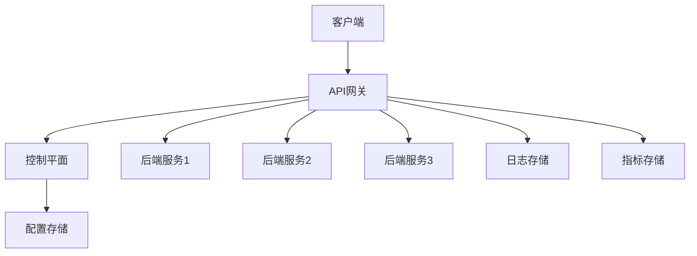

# MinGo API网关技术设计方案

## 1. 项目概述

MinGo API网关是一款基于ASP.NET Core和YARP实现的企业级API网关产品，旨在为微服务架构提供统一的流量入口、请求路由、负载均衡和安全防护能力。本设计文档详细描述了API网关的最小闭环技术实现细节，包括网关核心、控制平面、配置管理、监控和日志等核心功能。

### 1.1 设计目标

- 使用ASP.NET Core + YARP实现API网关核心功能
- 基于Blazor Server构建控制平面管理界面
- 实现配置的动态管理和下发
- 支持监控和日志管理
- 提供灵活的部署方案，支持动态缩扩容

### 1.2 技术栈

- **后端**：ASP.NET Core 10.0+
- **网关核心**：YARP (Yet Another Reverse Proxy)
- **前端**：Blazor Server
- **UI框架**：Tailwind CSS v4+ (CSS-first配置)
- **监控**：Prometheus + Grafana
- **日志**：ASP.NET Core日志系统
- **分布式追踪**：OpenTelemetry

## 2. 系统架构

### 2.1 整体架构



### 2.2 核心组件

#### 2.2.1 网关核心

- **请求处理器**：处理客户端请求，执行路由、负载均衡等逻辑
- **中间件链**：执行认证、授权、流量控制等中间件
- **健康检查器**：检查后端服务健康状态
- **负载均衡器**：实现负载均衡算法

#### 2.2.2 控制平面

- **配置管理服务**：管理网关配置
- **监控服务**：收集和分析网关指标
- **日志服务**：收集和管理网关日志
- **API管理服务**：管理API路由和后端服务

#### 2.2.3 数据存储

- **配置存储**：存储网关配置和路由规则
- **日志存储**：存储网关访问日志和错误日志
- **指标存储**：存储网关监控指标

## 3. 目录结构

```
MinGo.ReverseProxy/
├── docs/           # 文档目录
├── src/            # 源代码目录
│   ├── MinGo.Gateway/           # 网关核心
│   │   ├── Controllers/         # API控制器
│   │   ├── Middlewares/         # 中间件
│   │   ├── Services/            # 服务
│   │   ├── Config/              # 配置
│   │   ├── Program.cs           # 程序入口
│   │   └── MinGo.Gateway.csproj # 项目文件
│   ├── MinGo.ControlPlane/      # 控制平面
│   │   ├── Pages/               # Blazor页面
│   │   ├── Components/          # Blazor组件
│   │   ├── Services/            # 服务
│   │   ├── Data/                # 数据
│   │   ├── Program.cs           # 程序入口
│   │   └── MinGo.ControlPlane.csproj # 项目文件
│   └── MinGo.Shared/            # 共享组件
│       ├── Models/              # 共享模型
│       ├── Services/            # 共享服务
│       └── MinGo.Shared.csproj  # 项目文件
├── tests/          # 测试目录
└── .trae/          # Trae配置文件
```

## 4. 网关核心设计

### 4.1 网关主机 (GatewayHost)

**职责**：启动和管理网关服务

**实现要点**：
- 使用ASP.NET Core WebApplication构建
- 配置YARP路由
- 注册中间件
- 配置健康检查
- 配置监控和日志

**端口配置**：
- 网关端口：8080（HTTP）、8443（HTTPS）
- 管理端口：8081（用于内部管理API）

**核心代码结构**：
```csharp
var builder = WebApplication.CreateBuilder(args);

builder.Services.AddReverseProxy()
    .LoadFromConfig(builder.Configuration.GetSection("ReverseProxy"));

builder.Services.AddHealthChecks();

builder.Services.AddControllers();

var app = builder.Build();

app.UseRouting();

app.MapReverseProxy();

app.MapControllers();

app.MapHealthChecks("/health");

app.Run();
```

### 4.2 路由管理器 (RouteManager)

**职责**：管理和应用路由规则

**实现要点**：
- 使用YARP的IProxyConfigProvider接口
- 支持动态更新路由配置
- 从控制平面获取最新配置

**配置结构**：
```json
{
  "ReverseProxy": {
    "Routes": {
      "route1": {
        "ClusterId": "cluster1",
        "Match": {
          "Path": "/api/service1/{*remaining}"
        }
      }
    },
    "Clusters": {
      "cluster1": {
        "Destinations": {
          "destination1": {
            "Address": "http://localhost:5001"
          },
          "destination2": {
            "Address": "http://localhost:5002"
          }
        },
        "LoadBalancingPolicy": "RoundRobin",
        "HealthCheck": {
          "Active": {
            "Enabled": true,
            "Interval": "00:00:10",
            "Path": "/health"
          }
        }
      }
    }
  }
}
```

### 4.3 负载均衡器 (LoadBalancer)

**职责**：实现负载均衡算法

**实现要点**：
- 使用YARP内置的负载均衡策略
- 支持轮询、最少连接、随机、权重等策略

**负载均衡策略**：
- RoundRobin：轮询策略
- LeastRequests：最少连接策略
- Random：随机策略
- PowerOfTwoChoices：幂次选择策略

### 4.4 健康检查器 (HealthChecker)

**职责**：检查后端服务健康状态

**实现要点**：
- 使用YARP内置的健康检查机制
- 支持HTTP和TCP健康检查
- 配置健康检查间隔和路径

**健康检查配置**：
```json
{
  "HealthCheck": {
    "Active": {
      "Enabled": true,
      "Interval": "00:00:10",
      "Timeout": "00:00:05",
      "Path": "/health",
      "ExpectedStatusCodes": [200]
    },
    "Passive": {
      "Enabled": true,
      "Policy": "FailureRate",
      "ReactivationPeriod": "00:01:00"
    }
  }
}
```

### 4.5 中间件设计

#### 4.5.1 认证中间件 (AuthenticationMiddleware)

**职责**：处理请求认证，支持JWT、API密钥等认证方式

**实现要点**：
- 支持多种认证方式
- 验证JWT令牌
- 验证API密钥
- 支持自定义认证逻辑

**中间件代码结构**：
```csharp
public class AuthenticationMiddleware
{
    private readonly RequestDelegate _next;
    private readonly IAuthenticationService _authService;

    public AuthenticationMiddleware(RequestDelegate next, IAuthenticationService authService)
    {
        _next = next;
        _authService = authService;
    }

    public async Task InvokeAsync(HttpContext context)
    {
        var authHeader = context.Request.Headers["Authorization"].FirstOrDefault();
        var apiKey = context.Request.Headers["X-API-Key"].FirstOrDefault();

        if (await _authService.AuthenticateAsync(authHeader, apiKey))
        {
            await _next(context);
        }
        else
        {
            context.Response.StatusCode = 401;
            await context.Response.WriteAsync("Unauthorized");
        }
    }
}
```

#### 4.5.2 授权中间件 (AuthorizationMiddleware)

**职责**：处理请求授权，基于角色和权限

**实现要点**：
- 基于角色的访问控制
- 基于权限的访问控制
- 支持自定义授权策略

#### 4.5.3 速率限制中间件 (RateLimitMiddleware)

**职责**：实现请求速率限制，防止DDoS攻击

**实现要点**：
- 基于IP的速率限制
- 基于API密钥的速率限制
- 支持滑动窗口算法
- 支持令牌桶算法

**中间件代码结构**：
```csharp
public class RateLimitMiddleware
{
    private readonly RequestDelegate _next;
    private readonly IRateLimitService _rateLimitService;

    public RateLimitMiddleware(RequestDelegate next, IRateLimitService rateLimitService)
    {
        _next = next;
        _rateLimitService = rateLimitService;
    }

    public async Task InvokeAsync(HttpContext context)
    {
        var clientId = context.Connection.RemoteIpAddress?.ToString();
        var apiKey = context.Request.Headers["X-API-Key"].FirstOrDefault();

        if (await _rateLimitService.CheckRateLimitAsync(clientId, apiKey))
        {
            await _next(context);
        }
        else
        {
            context.Response.StatusCode = 429;
            await context.Response.WriteAsync("Too Many Requests");
        }
    }
}
```

#### 4.5.4 IP过滤中间件 (IpFilterMiddleware)

**职责**：基于IP地址的访问控制

**实现要点**：
- 支持IP白名单
- 支持IP黑名单
- 支持CIDR格式

#### 4.5.5 日志中间件 (LoggingMiddleware)

**职责**：记录请求和响应日志

**实现要点**：
- 记录请求信息（方法、路径、头部）
- 记录响应信息（状态码、响应时间）
- 支持结构化日志
- 支持日志过滤

## 5. 控制平面设计

### 5.1 控制平面主机 (ControlPlaneHost)

**职责**：启动和管理控制平面服务

**实现要点**：
- 使用ASP.NET Core WebApplication构建
- 配置Blazor Server
- 注册服务
- 配置认证和授权

**端口配置**：
- 控制平面端口：5000（HTTP）、5443（HTTPS）

**核心代码结构**：
```csharp
var builder = WebApplication.CreateBuilder(args);

builder.Services.AddRazorPages();
builder.Services.AddServerSideBlazor();

builder.Services.AddControllers();

builder.Services.AddScoped<IConfigService, ConfigService>();
builder.Services.AddScoped<IMonitoringService, MonitoringService>();
builder.Services.AddScoped<ILogService, LogService>();
builder.Services.AddScoped<IApiManagementService, ApiManagementService>();

var app = builder.Build();

app.UseStaticFiles();
app.UseRouting();

app.MapBlazorHub();
app.MapFallbackToPage("/_Host");

app.MapControllers();

app.Run();
```

### 5.2 配置服务 (ConfigService)

**职责**：管理网关配置

**实现要点**：
- 提供配置的CRUD操作
- 支持配置版本控制
- 实现配置的导入和导出
- 管理配置的下发

**服务接口**：
```csharp
public interface IConfigService
{
    Task<GatewayConfig> GetConfigAsync();
    Task<GatewayConfig> GetConfigByVersionAsync(string version);
    Task<GatewayConfig> CreateConfigAsync(GatewayConfig config);
    Task<GatewayConfig> UpdateConfigAsync(string id, GatewayConfig config);
    Task DeleteConfigAsync(string id);
    Task<IEnumerable<ConfigVersion>> GetConfigVersionsAsync();
    Task RollbackConfigAsync(string version);
    Task ExportConfigAsync(string version, Stream stream);
    Task<GatewayConfig> ImportConfigAsync(Stream stream);
    Task NotifyConfigChangeAsync(GatewayConfig config);
}
```

### 5.3 监控服务 (MonitoringService)

**职责**：收集和分析网关指标

**实现要点**：
- 集成Prometheus客户端
- 提供指标查询API
- 支持指标的可视化展示

**服务接口**：
```csharp
public interface IMonitoringService
{
    Task<MetricsSummary> GetMetricsSummaryAsync();
    Task<IEnumerable<RequestMetrics>> GetRequestMetricsAsync(DateTimeOffset start, DateTimeOffset end);
    Task<IEnumerable<ServiceMetrics>> GetServiceMetricsAsync();
    Task<IEnumerable<ErrorMetrics>> GetErrorMetricsAsync(DateTimeOffset start, DateTimeOffset end);
    Task<SystemMetrics> GetSystemMetricsAsync();
}
```

### 5.4 日志服务 (LogService)

**职责**：收集和管理网关日志

**实现要点**：
- 提供日志查询API
- 支持日志的过滤和排序
- 实现日志的导出

**服务接口**：
```csharp
public interface ILogService
{
    Task<IEnumerable<AccessLog>> GetAccessLogsAsync(LogQuery query);
    Task<IEnumerable<ErrorLog>> GetErrorLogsAsync(LogQuery query);
    Task<LogStatistics> GetLogStatisticsAsync(DateTimeOffset start, DateTimeOffset end);
    Task ExportLogsAsync(LogQuery query, Stream stream);
}
```

### 5.5 API管理服务 (ApiManagementService)

**职责**：管理API路由和后端服务

**实现要点**：
- 提供API路由的CRUD操作
- 管理后端服务集群
- 支持API文档的生成

**服务接口**：
```csharp
public interface IApiManagementService
{
    Task<IEnumerable<RouteConfig>> GetRoutesAsync();
    Task<RouteConfig> GetRouteAsync(string id);
    Task<RouteConfig> CreateRouteAsync(RouteConfig route);
    Task<RouteConfig> UpdateRouteAsync(string id, RouteConfig route);
    Task DeleteRouteAsync(string id);

    Task<IEnumerable<ClusterConfig>> GetClustersAsync();
    Task<ClusterConfig> GetClusterAsync(string id);
    Task<ClusterConfig> CreateClusterAsync(ClusterConfig cluster);
    Task<ClusterConfig> UpdateClusterAsync(string id, ClusterConfig cluster);
    Task DeleteClusterAsync(string id);
}
```

### 5.6 Blazor页面设计

#### 5.6.1 仪表盘页面 (Dashboard)

**功能**：
- 显示网关运行状态
- 显示关键指标（请求数、错误率、响应时间、活跃服务）
- 显示请求趋势图表
- 显示服务状态
- 显示最近请求列表

#### 5.6.2 路由管理页面 (Routes)

**功能**：
- 显示路由列表
- 添加新路由
- 编辑现有路由
- 删除路由
- 搜索和过滤路由

#### 5.6.3 集群管理页面 (Clusters)

**功能**：
- 显示集群列表
- 显示集群详情
- 添加新集群
- 编辑现有集群
- 删除集群
- 添加/删除目标

#### 5.6.4 安全管理页面 (Security)

**功能**：
- API密钥管理
- IP访问控制
- 速率限制配置

#### 5.6.5 监控页面 (Monitoring)

**功能**：
- 显示实时监控指标
- 显示历史监控数据
- 显示告警信息

#### 5.6.6 日志管理页面 (Logs)

**功能**：
- 查询访问日志
- 查询错误日志
- 导出日志
- 日志统计分析

#### 5.6.7 设置页面 (Settings)

**功能**：
- 网关配置
- 系统设置
- 用户管理

### 5.7 Tailwind CSS v4+ CSS-first配置

**概述**：
Tailwind CSS v4+引入了全新的CSS-first配置方式，不再依赖JavaScript配置文件，而是直接在CSS中使用`@theme`指令进行配置。这种方式更符合CSS原生特性，提供更好的性能和开发体验。

**配置文件结构**：
```
MinGo.ControlPlane/
├── wwwroot/
│   ├── css/
│   │   ├── app.css          # 主样式文件
│   │   └── theme.css        # 主题配置文件
│   └── js/
│       └── app.js           # JavaScript文件
├── Pages/
│   ├── _Host.cshtml         # 主机页面
│   └── _Layout.cshtml       # 布局页面
└── Program.cs
```

**app.css配置**：
```css
@import "tailwindcss";

@theme {
  --color-primary: #3b82f6;
  --color-secondary: #64748b;
  --color-success: #10b981;
  --color-warning: #f59e0b;
  --color-danger: #ef4444;
  
  --color-dark-100: #1e293b;
  --color-dark-200: #0f172a;
  --color-dark-300: #020617;
  
  --font-sans: 'Inter', system-ui, sans-serif;
  
  --spacing-xs: 0.25rem;
  --spacing-sm: 0.5rem;
  --spacing-md: 1rem;
  --spacing-lg: 1.5rem;
  --spacing-xl: 2rem;
  --spacing-2xl: 3rem;
  
  --radius-sm: 0.25rem;
  --radius-md: 0.5rem;
  --radius-lg: 0.75rem;
  --radius-xl: 1rem;
  --radius-full: 9999px;
  
  --shadow-sm: 0 1px 2px 0 rgb(0 0 0 / 0.05);
  --shadow-md: 0 4px 6px -1px rgb(0 0 0 / 0.1), 0 2px 4px -2px rgb(0 0 0 / 0.1);
  --shadow-lg: 0 10px 15px -3px rgb(0 0 0 / 0.1), 0 4px 6px -4px rgb(0 0 0 / 0.1);
  --shadow-xl: 0 20px 25px -5px rgb(0 0 0 / 0.1), 0 8px 10px -6px rgb(0 0 0 / 0.1);
}

@layer components {
  .card {
    @apply bg-white dark:bg-dark-100 rounded-xl shadow-sm border border-gray-200 dark:border-dark-200 p-6 transition-all duration-300;
  }
  
  .btn {
    @apply px-4 py-2 rounded-lg font-medium transition-all duration-200 focus:outline-none focus:ring-2 focus:ring-offset-2;
  }
  
  .btn-primary {
    @apply bg-primary text-white hover:bg-primary/90 focus:ring-primary/50;
  }
  
  .btn-secondary {
    @apply bg-gray-100 text-gray-800 dark:bg-dark-100 dark:text-gray-200 hover:bg-gray-200 dark:hover:bg-dark-200 focus:ring-gray-300 dark:focus:ring-dark-200;
  }
  
  .input {
    @apply w-full px-4 py-2 rounded-lg border border-gray-300 dark:border-dark-200 bg-white dark:bg-dark-200 text-gray-800 dark:text-gray-200 focus:outline-none focus:ring-2 focus:ring-primary/50 focus:border-primary transition-all duration-200;
  }
  
  .badge {
    @apply px-2 py-1 text-xs font-medium rounded-full;
  }
  
  .badge-success {
    @apply bg-success/10 text-success;
  }
  
  .badge-warning {
    @apply bg-warning/10 text-warning;
  }
  
  .badge-danger {
    @apply bg-danger/10 text-danger;
  }
}

@layer utilities {
  .content-auto {
    content-visibility: auto;
  }
}
```

**Program.cs配置**：
```csharp
var builder = WebApplication.CreateBuilder(args);

builder.Services.AddRazorPages();
builder.Services.AddServerSideBlazor();

builder.Services.AddControllers();

builder.Services.AddScoped<IConfigService, ConfigService>();
builder.Services.AddScoped<IMonitoringService, MonitoringService>();
builder.Services.AddScoped<ILogService, LogService>();
builder.Services.AddScoped<IApiManagementService, ApiManagementService>();

var app = builder.Build();

app.UseStaticFiles();

app.UseRouting();

app.MapBlazorHub();
app.MapFallbackToPage("/_Host");

app.MapControllers();

app.Run();
```

**_Host.cshtml配置**：
```html
@page "/"
@using MinGo.ControlPlane
@addTagHelper *, Microsoft.AspNetCore.Mvc.TagHelpers

<!DOCTYPE html>
<html lang="zh-CN">
<head>
    <meta charset="utf-8" />
    <meta name="viewport" content="width=device-width, initial-scale=1.0" />
    <title>MinGo API网关控制平面</title>
    <base href="~/" />
    <link rel="stylesheet" href="css/app.css" />
    <link rel="preconnect" href="https://fonts.googleapis.com">
    <link rel="preconnect" href="https://fonts.gstatic.com" crossorigin>
    <link href="https://fonts.googleapis.com/css2?family=Inter:wght@400;500;600;700&display=swap" rel="stylesheet">
</head>
<body class="bg-gray-50 dark:bg-dark-200 text-gray-800 dark:text-gray-200 min-h-screen transition-colors duration-300">
    <div id="app">
        <component type="typeof(App)" render-mode="ServerPrerendered" />
    </div>

    <script src="_framework/blazor.server.js"></script>
    <script src="js/app.js"></script>
</body>
</html>
```

**项目文件配置 (MinGo.ControlPlane.csproj)**：
```xml
<Project Sdk="Microsoft.NET.Sdk.Web">

  <PropertyGroup>
    <TargetFramework>net10.0</TargetFramework>
    <Nullable>enable</Nullable>
    <ImplicitUsings>enable</ImplicitUsings>
  </PropertyGroup>

  <ItemGroup>
    <PackageReference Include="Microsoft.AspNetCore.Components.Web" Version="10.0.0" />
    <PackageReference Include="Microsoft.AspNetCore.Components.WebAssembly.Server" Version="10.0.0" />
  </ItemGroup>

</Project>
```

**Tailwind CSS v4+特性**：
- **CSS-first配置**：直接在CSS中使用`@theme`指令配置主题
- **原生CSS变量**：使用CSS变量定义颜色、间距、字体等
- **更好的性能**：无需JavaScript运行时配置，构建时优化
- **类型安全**：支持TypeScript类型定义
- **更好的IDE支持**：提供更好的代码补全和类型检查

**暗色模式支持**：
```css
@theme {
  --color-background: #ffffff;
  --color-text: #1f2937;
}

@media (prefers-color-scheme: dark) {
  @theme {
    --color-background: #0f172a;
    --color-text: #f3f4f6;
  }
}

.dark {
  --color-background: #0f172a;
  --color-text: #f3f4f6;
}
```

**响应式设计**：
```css
@layer components {
  .sidebar {
    @apply fixed inset-y-0 left-0 w-64 bg-white dark:bg-dark-100 border-r border-gray-200 dark:border-dark-200 flex flex-col transform -translate-x-full md:translate-x-0 transition-transform duration-300 ease-in-out z-40;
  }
  
  @media (min-width: 768px) {
    .sidebar {
      @apply transform-none;
    }
  }
}
```

## 6. 配置管理

### 6.1 配置存储

**存储方式**：
- 开发环境：JSON文件
- 生产环境：数据库（SQL Server/PostgreSQL）

**配置结构**：
```csharp
public class GatewayConfig
{
    public string Id { get; set; }
    public string Version { get; set; }
    public DateTimeOffset CreatedAt { get; set; }
    public string CreatedBy { get; set; }
    public Dictionary<string, RouteConfig> Routes { get; set; }
    public Dictionary<string, ClusterConfig> Clusters { get; set; }
    public SecurityConfig Security { get; set; }
    public MonitoringConfig Monitoring { get; set; }
}

public class RouteConfig
{
    public string ClusterId { get; set; }
    public RouteMatch Match { get; set; }
    public RouteTransforms Transforms { get; set; }
    public bool Enabled { get; set; }
}

public class ClusterConfig
{
    public Dictionary<string, DestinationConfig> Destinations { get; set; }
    public string LoadBalancingPolicy { get; set; }
    public HealthCheckConfig HealthCheck { get; set; }
}

public class SecurityConfig
{
    public List<ApiKeyConfig> ApiKeys { get; set; }
    public IpRulesConfig IpRules { get; set; }
    public RateLimitConfig RateLimits { get; set; }
}
```

### 6.2 配置版本控制

**实现方式**：
- 每次配置变更生成新版本
- 支持配置的回滚
- 记录配置变更历史

**版本控制接口**：
```csharp
public interface IConfigVersionService
{
    Task<string> CreateVersionAsync(GatewayConfig config);
    Task<GatewayConfig> GetVersionAsync(string version);
    Task<IEnumerable<ConfigVersion>> GetVersionsAsync();
    Task RollbackToVersionAsync(string version);
}
```

### 6.3 配置下发机制

**推送模式**：
- 控制平面主动推送配置变更到网关实例
- 使用SignalR实现实时推送

**拉取模式**：
- 网关实例定期从控制平面拉取最新配置
- 使用HTTP轮询

**配置同步**：
- 使用ETag或版本号确保配置一致性
- 支持批量配置更新

**配置下发接口**：
```csharp
[ApiController]
[Route("api/[controller]")]
public class ConfigController : ControllerBase
{
    [HttpGet]
    public async Task<ActionResult<GatewayConfig>> GetConfig()
    {
        var config = await _configService.GetConfigAsync();
        return Ok(config);
    }

    [HttpGet("{version}")]
    public async Task<ActionResult<GatewayConfig>> GetConfigByVersion(string version)
    {
        var config = await _configService.GetConfigByVersionAsync(version);
        return Ok(config);
    }

    [HttpPost]
    public async Task<ActionResult<GatewayConfig>> CreateConfig([FromBody] GatewayConfig config)
    {
        var created = await _configService.CreateConfigAsync(config);
        return CreatedAtAction(nameof(GetConfig), new { version = created.Version }, created);
    }

    [HttpPut("{id}")]
    public async Task<ActionResult<GatewayConfig>> UpdateConfig(string id, [FromBody] GatewayConfig config)
    {
        var updated = await _configService.UpdateConfigAsync(id, config);
        await _configService.NotifyConfigChangeAsync(updated);
        return Ok(updated);
    }
}
```

## 7. 监控和日志

### 7.1 监控系统

**指标收集**：
- 使用ASP.NET Core内置的Metrics
- 集成Prometheus客户端

**指标类型**：
- 请求量
- 响应时间
- 错误率
- 系统指标（CPU、内存、网络）

**Prometheus配置**：
```csharp
builder.Services.AddMetrics();
builder.Services.AddPrometheusMetrics();
```

**指标端点**：
```csharp
app.MapPrometheusMetrics();
```

**指标查询接口**：
```csharp
[ApiController]
[Route("api/[controller]")]
public class MetricsController : ControllerBase
{
    [HttpGet("summary")]
    public async Task<ActionResult<MetricsSummary>> GetSummary()
    {
        var summary = await _monitoringService.GetMetricsSummaryAsync();
        return Ok(summary);
    }

    [HttpGet("requests")]
    public async Task<ActionResult<IEnumerable<RequestMetrics>>> GetRequests(
        [FromQuery] DateTimeOffset start,
        [FromQuery] DateTimeOffset end)
    {
        var metrics = await _monitoringService.GetRequestMetricsAsync(start, end);
        return Ok(metrics);
    }
}
```

### 7.2 日志系统

**日志收集**：
- 使用ASP.NET Core内置的日志系统
- 支持多种日志提供者（Console、File、Elasticsearch）

**日志类型**：
- 访问日志
- 错误日志
- 调试日志

**日志配置**：
```csharp
builder.Logging.AddConsole();
builder.Logging.AddFile("logs/gateway-{Date}.log");
```

**日志查询接口**：
```csharp
[ApiController]
[Route("api/[controller]")]
public class LogsController : ControllerBase
{
    [HttpGet("access")]
    public async Task<ActionResult<IEnumerable<AccessLog>>> GetAccessLogs([FromQuery] LogQuery query)
    {
        var logs = await _logService.GetAccessLogsAsync(query);
        return Ok(logs);
    }

    [HttpGet("errors")]
    public async Task<ActionResult<IEnumerable<ErrorLog>>> GetErrorLogs([FromQuery] LogQuery query)
    {
        var logs = await _logService.GetErrorLogsAsync(query);
        return Ok(logs);
    }
}
```

### 7.3 分布式追踪

**实现方式**：
- 集成OpenTelemetry
- 支持Jaeger或Zipkin

**追踪内容**：
- 请求链路
- 服务调用
- 错误信息

**OpenTelemetry配置**：
```csharp
builder.Services.AddOpenTelemetry()
    .ConfigureResource(resource => resource
        .AddService("MinGo.Gateway"))
    .AddAspNetCoreInstrumentation()
    .AddHttpClientInstrumentation()
    .AddOtlpExporter();
```

## 8. 部署方案

### 8.1 单机部署

**适用场景**：开发和测试环境

**部署方式**：
- 所有组件部署在同一台服务器上
- 使用JSON文件存储配置

**配置文件**：
```json
{
  "Kestrel": {
    "Endpoints": {
      "GatewayHttp": {
        "Url": "http://localhost:8080"
      },
      "GatewayHttps": {
        "Url": "https://localhost:8443"
      },
      "ControlPlaneHttp": {
        "Url": "http://localhost:5000"
      },
      "ControlPlaneHttps": {
        "Url": "https://localhost:5443"
      }
    }
  },
  "ReverseProxy": {
    "Routes": {},
    "Clusters": {}
  }
}
```

### 8.2 集群部署

**适用场景**：生产环境

**部署方式**：
- 网关实例集群部署，通过负载均衡器分发请求
- 控制平面单独部署，管理所有网关实例
- 使用数据库存储配置

**架构图**：
```
                    +------------------+
                    |   Load Balancer  |
                    +--------+---------+
                             |
        +--------------------+--------------------+
        |                    |                    |
+-------v-------+   +-------v-------+   +-------v-------+
|  Gateway Node  |   |  Gateway Node  |   |  Gateway Node  |
|  Port: 8080    |   |  Port: 8080    |   |  Port: 8080    |
+-------+-------+   +-------+-------+   +-------+-------+
        |                    |                    |
        +--------------------+--------------------+
                             |
                    +-------v-------+
                    | Control Plane  |
                    |  Port: 5000    |
                    +-------+-------+
                            |
                    +-------v-------+
                    |   Database    |
                    +---------------+
```

### 8.3 Docker部署

**Gateway Dockerfile**：
```dockerfile
FROM mcr.microsoft.com/dotnet/aspnet:10.0 AS base
WORKDIR /app
EXPOSE 8080
EXPOSE 8443

FROM mcr.microsoft.com/dotnet/sdk:10.0 AS build
WORKDIR /src
COPY ["src/MinGo.Gateway/MinGo.Gateway.csproj", "src/MinGo.Gateway/"]
COPY ["src/MinGo.Shared/MinGo.Shared.csproj", "src/MinGo.Shared/"]
RUN dotnet restore "src/MinGo.Gateway/MinGo.Gateway.csproj"
COPY . .
WORKDIR "/src/src/MinGo.Gateway"
RUN dotnet build "MinGo.Gateway.csproj" -c Release -o /app/build

FROM build AS publish
RUN dotnet publish "MinGo.Gateway.csproj" -c Release -o /app/publish /p:UseAppHost=false

FROM base AS final
WORKDIR /app
COPY --from=publish /app/publish .
ENTRYPOINT ["dotnet", "MinGo.Gateway.dll"]
```

**ControlPlane Dockerfile**：
```dockerfile
FROM mcr.microsoft.com/dotnet/aspnet:10.0 AS base
WORKDIR /app
EXPOSE 5000
EXPOSE 5443

FROM mcr.microsoft.com/dotnet/sdk:10.0 AS build
WORKDIR /src
COPY ["src/MinGo.ControlPlane/MinGo.ControlPlane.csproj", "src/MinGo.ControlPlane/"]
COPY ["src/MinGo.Shared/MinGo.Shared.csproj", "src/MinGo.Shared/"]
RUN dotnet restore "src/MinGo.ControlPlane/MinGo.ControlPlane.csproj"
COPY . .
WORKDIR "/src/src/MinGo.ControlPlane"
RUN dotnet build "MinGo.ControlPlane.csproj" -c Release -o /app/build

FROM build AS publish
RUN dotnet publish "MinGo.ControlPlane.csproj" -c Release -o /app/publish /p:UseAppHost=false

FROM base AS final
WORKDIR /app
COPY --from=publish /app/publish .
ENTRYPOINT ["dotnet", "MinGo.ControlPlane.dll"]
```

**Docker Compose**：
```yaml
version: '3.8'

services:
  gateway:
    build:
      context: .
      dockerfile: src/MinGo.Gateway/Dockerfile
    ports:
      - "8080:8080"
      - "8443:8443"
    environment:
      - ASPNETCORE_ENVIRONMENT=Production
      - CONFIG_ENDPOINT=http://controlplane:5000/api/config
    depends_on:
      - controlplane

  controlplane:
    build:
      context: .
      dockerfile: src/MinGo.ControlPlane/Dockerfile
    ports:
      - "5000:5000"
      - "5443:5443"
    environment:
      - ASPNETCORE_ENVIRONMENT=Production
      - DATABASE_CONNECTION=Server=database;Database=MinGo;User Id=sa;Password=YourPassword123;
    depends_on:
      - database

  database:
    image: mcr.microsoft.com/mssql/server:2022-latest
    environment:
      - ACCEPT_EULA=Y
      - SA_PASSWORD=YourPassword123
    ports:
      - "1433:1433"
    volumes:
      - mssql-data:/var/opt/mssql

  prometheus:
    image: prom/prometheus:latest
    ports:
      - "9090:9090"
    volumes:
      - ./prometheus.yml:/etc/prometheus/prometheus.yml

  grafana:
    image: grafana/grafana:latest
    ports:
      - "3000:3000"
    environment:
      - GF_SECURITY_ADMIN_PASSWORD=admin
    depends_on:
      - prometheus

volumes:
  mssql-data:
```

### 8.4 Kubernetes部署

**Gateway部署**：
```yaml
apiVersion: apps/v1
kind: Deployment
metadata:
  name: mingogo-gateway
spec:
  replicas: 3
  selector:
    matchLabels:
      app: mingogo-gateway
  template:
    metadata:
      labels:
        app: mingogo-gateway
    spec:
      containers:
      - name: gateway
        image: mingogo/gateway:latest
        ports:
        - containerPort: 8080
        - containerPort: 8443
        env:
        - name: ASPNETCORE_ENVIRONMENT
          value: "Production"
        - name: CONFIG_ENDPOINT
          value: "http://mingogo-controlplane:5000/api/config"
        resources:
          requests:
            memory: "256Mi"
            cpu: "250m"
          limits:
            memory: "512Mi"
            cpu: "500m"
        livenessProbe:
          httpGet:
            path: /health
            port: 8080
          initialDelaySeconds: 30
          periodSeconds: 10
        readinessProbe:
          httpGet:
            path: /health
            port: 8080
          initialDelaySeconds: 5
          periodSeconds: 5
---
apiVersion: v1
kind: Service
metadata:
  name: mingogo-gateway
spec:
  selector:
    app: mingogo-gateway
  ports:
  - name: http
    port: 80
    targetPort: 8080
  - name: https
    port: 443
    targetPort: 8443
  type: LoadBalancer
```

**ControlPlane部署**：
```yaml
apiVersion: apps/v1
kind: Deployment
metadata:
  name: mingogo-controlplane
spec:
  replicas: 1
  selector:
    matchLabels:
      app: mingogo-controlplane
  template:
    metadata:
      labels:
        app: mingogo-controlplane
    spec:
      containers:
      - name: controlplane
        image: mingogo/controlplane:latest
        ports:
        - containerPort: 5000
        - containerPort: 5443
        env:
        - name: ASPNETCORE_ENVIRONMENT
          value: "Production"
        - name: DATABASE_CONNECTION
          value: "Server=mssql;Database=MinGo;User Id=sa;Password=YourPassword123;"
        resources:
          requests:
            memory: "512Mi"
            cpu: "500m"
          limits:
            memory: "1Gi"
            cpu: "1000m"
        livenessProbe:
          httpGet:
            path: /health
            port: 5000
          initialDelaySeconds: 30
          periodSeconds: 10
        readinessProbe:
          httpGet:
            path: /health
            port: 5000
          initialDelaySeconds: 5
          periodSeconds: 5
---
apiVersion: v1
kind: Service
metadata:
  name: mingogo-controlplane
spec:
  selector:
    app: mingogo-controlplane
  ports:
  - name: http
    port: 80
    targetPort: 5000
  - name: https
    port: 443
    targetPort: 5443
  type: ClusterIP
```

**Database部署**：
```yaml
apiVersion: apps/v1
kind: Deployment
metadata:
  name: mssql
spec:
  replicas: 1
  selector:
    matchLabels:
      app: mssql
  template:
    metadata:
      labels:
        app: mssql
    spec:
      containers:
      - name: mssql
        image: mcr.microsoft.com/mssql/server:2022-latest
        ports:
        - containerPort: 1433
        env:
        - name: ACCEPT_EULA
          value: "Y"
        - name: SA_PASSWORD
          value: "YourPassword123"
        resources:
          requests:
            memory: "2Gi"
            cpu: "1000m"
          limits:
            memory: "4Gi"
            cpu: "2000m"
        volumeMounts:
        - name: mssql-data
          mountPath: /var/opt/mssql
      volumes:
      - name: mssql-data
        persistentVolumeClaim:
          claimName: mssql-pvc
---
apiVersion: v1
kind: Service
metadata:
  name: mssql
spec:
  selector:
    app: mssql
  ports:
  - port: 1433
    targetPort: 1433
  type: ClusterIP
---
apiVersion: v1
kind: PersistentVolumeClaim
metadata:
  name: mssql-pvc
spec:
  accessModes:
    - ReadWriteOnce
  resources:
    requests:
      storage: 10Gi
```

### 8.5 环境要求

| 环境 | CPU | 内存 | 存储 | 网络 |
|------|-----|------|------|------|
| 开发环境 | 2核 | 4GB | 50GB | 1Gbps |
| 测试环境 | 4核 | 8GB | 100GB | 1Gbps |
| 生产环境 | 8核+ | 16GB+ | 200GB+ | 10Gbps+ |

## 9. 安全考虑

### 9.1 认证和授权

**控制平面**：使用ASP.NET Core Identity实现认证和授权

**API网关**：支持多种认证方式，包括JWT、API密钥等

**权限管理**：基于角色的访问控制，确保只有授权用户可以访问管理界面

### 9.2 数据加密

**传输加密**：使用HTTPS加密传输

**存储加密**：敏感配置和API密钥的加密存储

**密钥管理**：使用密钥管理服务管理加密密钥

### 9.3 安全防护

**DDoS防护**：实现速率限制和请求过滤

**SQL注入防护**：使用参数化查询和ORM

**XSS防护**：实现输入验证和输出编码

**CSRF防护**：使用Anti-CSRF令牌

### 9.4 安全审计

**审计日志**：记录所有管理操作的审计日志

**安全扫描**：定期进行安全扫描和漏洞评估

**合规性**：遵循OWASP安全最佳实践

## 10. 性能优化

### 10.1 并发处理

**异步处理**：全异步请求处理，提高并发能力

**连接池**：优化后端服务连接管理，减少连接建立开销

**缓存**：缓存路由规则和配置信息，减少重复计算

### 10.2 资源使用

**内存优化**：减少内存使用，支持高并发

**CPU优化**：优化请求处理逻辑，减少CPU占用

**网络优化**：使用HTTP/2和HTTP/3，减少网络延迟

### 10.3 扩展性

**插件系统**：支持自定义中间件和插件

**服务发现**：集成服务发现机制，支持动态服务注册

**负载均衡**：优化负载均衡算法，提高分发效率

## 11. 开发测试计划

### 11.1 开发流程

**代码管理**：使用Git进行代码版本控制

**分支策略**：采用GitFlow分支策略

**CI/CD**：集成GitHub Actions或Azure DevOps实现CI/CD

### 11.2 测试策略

**单元测试**：测试核心组件和功能

**集成测试**：测试组件之间的集成

**性能测试**：测试网关的性能和并发能力

**安全测试**：测试网关的安全防护能力

### 11.3 测试工具

**单元测试**：xUnit

**集成测试**：WebApplicationFactory

**性能测试**：JMeter或Gatling

**安全测试**：OWASP ZAP

### 11.4 部署流程

**开发环境**：自动部署到开发服务器

**测试环境**：通过测试后部署到测试服务器

**生产环境**：手动审核后部署到生产服务器

## 12. 总结

本设计文档详细描述了MinGo API网关的最小闭环技术实现细节，包括网关核心、控制平面、配置管理、监控和日志等核心功能。通过使用ASP.NET Core 10.0+ + YARP + Blazor + Tailwind CSS v4+ CSS-first配置的技术栈，实现了一个功能完备、性能优异的企业级API网关产品。

该设计方案具有以下特点：

- **模块化设计**：将网关核心和控制平面分离，便于独立部署和扩展
- **动态配置**：支持配置的动态管理和下发，无需重启网关
- **全面监控**：集成Prometheus + Grafana，提供实时监控和告警
- **安全可靠**：实现了多种安全防护机制，确保网关的安全性
- **现代技术栈**：采用ASP.NET Core 10.0+和Tailwind CSS v4+ CSS-first配置，提供更好的性能和开发体验
- **灵活部署**：支持单机部署和集群部署，适应不同的应用场景

通过本设计方案的实现，MinGo API网关将为微服务架构提供统一的流量入口和管理平台，帮助企业提升系统的可靠性、安全性和可维护性，为业务发展提供坚实的技术支撑。
